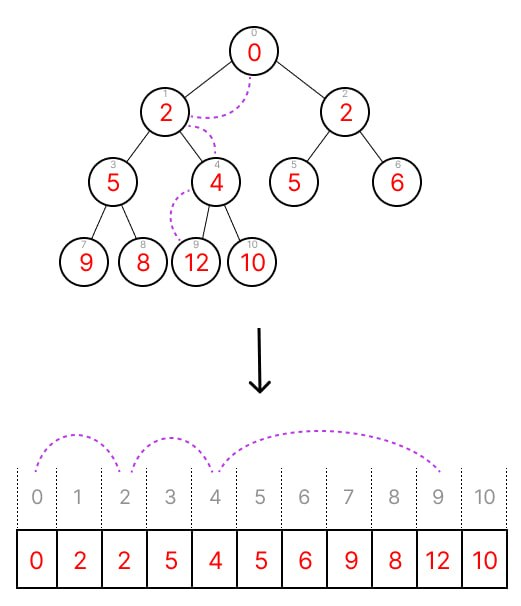

markdown
[Русская версия](README.ru.md)

# Memcache
memcache is a minimalist, high-performance, low-latency in-memory cache for Go. Designed as a lightweight library embedded directly into your Go application, it features built-in sharding, an LRU (Least Recently Used) eviction policy, and TTL-based (Time-to-Live) expiration.

The cache addresses three core challenges:
* reducing CPU overhead caused by lock contention ([**lock contention**](#lock_contention))
* evicting items that haven't been accessed for the longest time ([**Least recently used**](#lru))
* controlling the lifespan of each record, removing expired entries from memory ([**Time-to-live**](#ttl))

<a id="lock_contention"></a>

### Lock contention

When multiple goroutines concurrently access the cache for writing, synchronization via a mutex is required to protect internal data structures and prevent data races. However, if a single mutex covers the entire cache under heavy load, most of the time is wasted waiting in a blocked state. This issue is resolved using sharding. The cache is divided into independent segments (shards), each managed by its own individual mutex.

#### Shard Index Calculation

Determining the correct shard for a key-value pair is always deterministic and operates with minimal CPU overhead due to two architectural decisions:

**The number of shards** is a power of two. This allows us to use bitwise arithmetic for shard index calculation, which is highly optimized for the CPU.

**The hash function** instantly computes a numeric value based on the key, adhering to two rules:
- the hash for the exact same key is always identical
- hashes for two similar keys differ drastically from one another

Identifying the required shard boils down to a single operation: a bitwise AND between the key's hash and a number equal to the total shard count minus 1.

```
111001100001101010011011010100101 (hash)
AND
000000000000000000000000000011111 (number of shards minus 1)
=
00101 (which is 9 in decimal representation)
```

This operation yields the last bits of the hash. Their decimal representation serves as the shard index.


<a id="lru"></a>

### LRU

Evicting the least recently accessed element is implemented using a doubly linked list. This is a linear chain of nodes where each node stores a key and two pointers: one to the previous node and one to the next. For the very first node (**HEAD**), the previous pointer is `nil`. Correspondingly, for the very last node (**TAIL**), the next pointer is also `nil`.

- when an element is accessed, we simply update the pointers of the node and its neighbors, moving it to the head of the list
- when the maximum capacity is exceeded, we close the pointers of the last element's neighbors onto each other to remove it

These operations run in constant time O(1) and guarantee that the eviction candidate is always positioned at the tail of the list.

How it works:


*moving an element to the head and removing an element from the tail is achieved by changing the pointer values of the element and its neighbors, without affecting the rest of the list*

<a id="ttl"></a>

### TTL

Cleaning up expired records is handled by another data structure — a binary min-heap (**Min-heap**). It represents a linearized binary tree balanced by its branches.

Min-heap



*the purple line illustrates the relationship between a tree branch and the underlying slice slots*

The heap is formed by mapping tree nodes into a slice using the following principle:

```
left child index = 2 * parent index + 1
right child index = 2 * parent index + 2
```

The core property of such a tree is that a parent is always smaller than any of its children. This means every branch (nodes from the youngest child up to the oldest parent) is sorted in non-decreasing order from top to bottom. However, children of the same parent are not necessarily sorted relative to each other.

This structure guarantees that expired nodes always bubble up to the top of the heap. All that remains is to remove elements from the beginning of the heap and rebalance it. Since this process is executed by a background worker, it does not impact the main cache performance.

To maintain order within each branch, the **sift-up** algorithm is applied: a new element is appended to the end of the heap, then sequentially compared and swapped with its parents if it is smaller. The process stops as soon as a parent smaller than the current element is found. This algorithm ensures proper heap balancing within logarithmic time complexity O(log n).